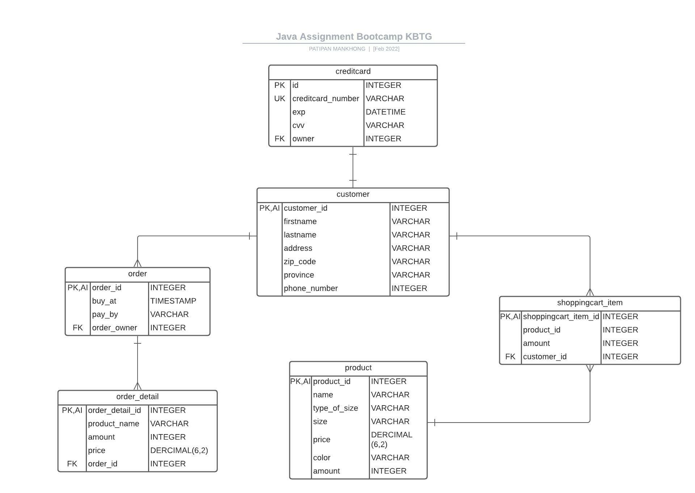

# Design Model

## คำอธิบาย

ออกแบบการเลือกซื้อสินค้าและชำระด้วยบัตรเครดิต มี model สำหรับเก็บข้อมูล ดังต่อไปนี้

## WorkFlow

- customer search สินค้าที่ต้องการซื้อด้วยชื่อ
- customer เจอสินค้าที่อยากและได้เห็นรายละเอียดของสินค้า
- customer add สินค้าลงตะกร้า
    - customer อาจเปลี่ยนใจ remove สินค้าออกจากตะกร้าได้
    - customer อาจเปลี่ยนใจ add สินค้าเพิ่มได้
- customer เช็ึครายะเอียดสินค้าที่อยู่ในตะกร้าก่อน checkout
- customer ชำระสินค้า
- customer ใส่ที่อยู่ในการจัดส่งสินค้า
- customer ชำระสินค้าด้วยบัตรเครดิตแล้วกรอกข้อมูลของบัตร
- customer กดชำระสินค้าแล้วโชว์ผลการชำระเงิน ที่อยู่ ของ customer

## ER Diagram

## Feature

- ค้นหา product ด้วยชื่อของสินค้า
- บันทึกข้อมูลที่อยู่การจัดส่ง
- บันทึกบัตรเครดิต โดยจะมีการเข้ารหัสข้อมูลบัตรเอาไว้
- เพิ่ม / ลด สินค้าจากตะกร้าได้
- checkout เพื่อทำการชำระสินค้า

## Endpoint

| method | url                      | Description                    | Sample Valid Request Body                  | Sample Valid Response Body |
|--------|--------------------------|--------------------------------|--------------------------------------------|----------------------------|
| GET    | /customers/addCreditCard | เพิ่มบัตรเครดิตให้กับ customer | [JSON](/sample/request/addCreditCard.json) |                            |
|        |                          |                                |                                            |                            |
|        |                          |                                |                                            |                            |
